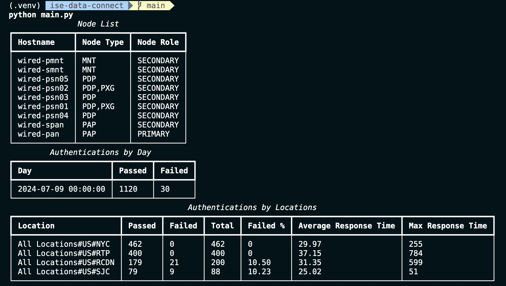

[](https://developer.cisco.com/codeexchange/github/repo/chetanph/ise-data-connect)

# ISE Data Connect

This repository provides a Python library to interact with Cisco Identity Services Engine (ISE) Data Connect.

```python
from ise import IseDataConnect

with IseDataConnect("ise-snmt.example.org", "2484", "dataconnect", "Cisco.123456#", verify=False) as ise_dc:
    for node in ise_dc.get_node_list():
      print(f"{node.hostname} {node.node_type} {node.replication_status}")

    for admin_user in ise_dc.execute_query("SELECT * FROM 'ADMIN_USERS'"):
      print(admin_user)
```

The `main.py` example shows how to obtain node list as well as execute SQL queries for RADIUS
authentication summary reports.



## Installation

Clone the repo:

```bash
git clone https://github.com/chetanph/ise-data-connect.git

cd ise-data-connect
```

Create the virtual environment and activate it:

```bash
python3 -m venv .venv

source .venv/bin/activate
```

Install dependencies

```bash
pip install -r requirements.txt
```

## Configuration

Provide input configuration, either as environment variables or CLI arguments.

```bash
# (Option 1) Environment Variables
export ISE_HOSTNAME="ise-snmt.example.org"
export ISE_DATACONNECT_PORT="2484"
export DATACONNECT_USER="dataconnect"
export DATACONNECT_PASSWORD="Cisco123456#"

# (Option 2)
python main.py \
  --ise_hostname "ise-snmt.example.org" \
  --ise_dataconnect_port "2484" \
  --dataconnect_user "dataconnect" \
  --dataconnect_password "Cisco123456#"
```

## How to test the software

Make sure to follow the ISE Data Connect [Getting Started](https://developer.cisco.com/docs/dataconnect/getting-started/#getting-started) guide to enable Data Connect feature.

Follow the steps described above to setup the automation environment.

The automation environment must have access to ISE node, typically secondary Monitoring node, over TCP/2484 port.

Then run main app

```bash
python main.py
```

This has been tested with Python 3.11 and ISE version 3.2.

### DevNet Sandbox

https://devnetsandbox.cisco.com/DevNet/catalog/ise-sandbox

## Getting help

If you have questions, concerns, bug reports, etc., please create an issue against this repository.

## Author(s)

This project was written and is maintained by the following individuals:

* Chetankumar Phulpagare
